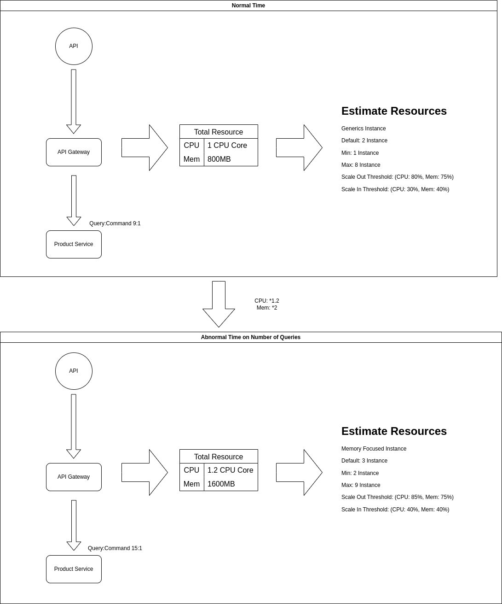

# 計測によるパターン比較

> 今回はマイクロサービスパターンで考慮される領域の一つである`CQRS`か`API Composition`についてとそれと共に使用される`Event Sourcing`か`State Based`かの比較を行う.
> ここではその比較を行う計測値を決定する.

## API CompositionとCQRS

- **API Composition** はシンプルで柔軟性があり, データ整合性が求められるが, スケーラビリティや取得時のパフォーマンスの問題がある.
- **CQRS** はスケーラビリティやパフォーマンスに優れ, 技術スタックも適した選択が可能であるが, 設計や運用が複雑になり, データ反映に多少の時間がかかることが欠点となる.

## 効果的と予測されるアーキテクチャ要件

---
### 機能適合性(Functional Suitability): ビジネス的評価
---

同様のAPI定義を実装するため, ビジネス要件での評価に対する影響は大きく異ならない.

---
### 性能効率性(Performance Efficiency): パフォーマンス評価
---

#### タイムリネス(Timeliness)
- システムがタイムリーに適切なレスポンスやアクションを提供する能力.
- GETリクエストに関してのレスポンス時間比較を行う.

#### 効率性(Efficiency) 
- システムがリソースを最小限に消費して最大限の成果を出す能力.
- CPU使用率, メモリ消費の計測比較を各サービスやAPI Gatewayに対して行う.

#### 弾力性(Elasticity)
- システムが負荷の増大に対応して効果的にスケーリングアップおよびスケーリングダウンする能力.
- クエリだけもしくはコマンドだけの偏ったリクエストが来たときでも適切にスケールできるかを比較する.
- また, 長期的なスケールなどを適切に行えているかを表すスケーラビリティについては, しきい値の適切な設定による回避が可能であるため, 今回は通常時の比率を基にしきい値を設定した後, さらに偏った際の計測を行う.

---
### レジリエンス(Resilience): 持続可能性評価
---

ほとんどの指標において長期的な利用が求められるため, 今回は以下のような観点のみの予測が有効である.

#### 可用性(Availability)
- システムが必要とされたときに利用可能である度合い.
- 正確な計測には長期の時間を要するため, 今回はサービスごとの可用性は固定した上で, クエリが依存するサービス数に基づき, クエリ結果の可用性を計算で簡易的に導いての比較を行う.ただし, この際のクエリは実際のアプリケーションで利用されるような現実的なものとする.

---
### ユーザビリティ(Usability): ユーザー体験評価
---

同様のAPI定義を実装するため, エンドユーザーへのユーザビリティ評価は行わない.

---
### 開発生産性(Developer Productivity): 開発効率評価
---

#### 理解容易性(Understandability)
- 開発チームがアーキテクチャやシステムコードをどれだけ簡単に理解できるかを示す.
- コードの複雑性を示す指標を用いるか, 開発者が特定の機能やコード部分を理解するために要するナビゲーション時間の計測などを行う.

#### 変更容易性(Changeability)
- システムの特定の部分を修正または更新する際の容易さを表す指標.
- システム要件に少しの変更を与えたあと, システム全体での影響範囲の測定を行う,

#### テスト容易性(Testability)
- システムまたはコンポーネントがどれだけ効率的にテストできるかという特性.
- CQRSではPub/Subを用いるため, テストが困難であることを示す指標や, 統合テストでのテスト時間などが有効である.

#### デプロイ容易性(Deployability)
- システムがどれだけ簡単にデプロイ(展開)できるかを表す.
- CQRSではサービスの数だけでも多くなる傾向にあり, インフラの複雑化が考えられるため, その困難さを表す指標やデプロイ時間の測定などが有効である.

---
### 運用管理性(Operational Manageability): 運用効率評価
---

#### 監査可能性(Auditability) 
- システムの活動が記録され, 検証可能である特性.
- CQRS+Event Sourcingではすべてのイベントを保持し続けるため, 履歴の再現などが行いやすく検証が行いやすいため, これを表す指標があれば有効である.

---
### コード品質(Code Quality): コード品質評価
---

#### 可読性(Readability)
- コードが他の開発者にとってどれだけ読みやすいかを示す.
- システムの複雑性にも関連する指標であるため, この指標自体にも影響が出る可能性もある.
- ただし, CQRSのようにコマンドとクエリで分けられていることからコードレベルでの可読性は向上しているという見方もある.

#### 独立性(Independence)
- コードが他のコード部分に依存せずに機能する程度を示す.
- CQRSではコマンドとクエリで分けられていることから, コードレベルでの独立性も向上していることが考えられる.

---
### セキュリティ(Security): 脆弱性評価
---

#### 攻撃耐性(Attack Resistance)
- システムが外部からの不正アクセスや攻撃(例: DDoS攻撃, SQLインジェクション)に対してどれだけ防御力を持っているかを評価する特性.
- CQRSでは読み取りと書き込みの分離により攻撃面が分散され, 攻撃範囲を最小限に抑えられることが考えられる.

#### プライバシー(Privacy)
- 従業員から取引を隠せるかの指標.
- すべてのイベントを履歴に残し, 基本的にはデータの削除を行わないCQRS(のコマンド用サービス)に関しては, 暗号化も難しい上に残り続けるため, プライバシー保護が重要となる.

---
### データ整合性(Data Integrity): データ品質評価
---

#### 一貫性(Consistency)
- システム内の情報や動作が矛盾しない一貫した特性.
- CQRSでは, コマンド用サービスとクエリ用サービスの更新にラグが生じてしまうため, 一定時間許容する必要があり, その大体時間を計測することは効果的である.

---
### 適応性(Adaptability): 適応評価
---

#### 移植性(Portability)
- システムが異なる環境間で効率的な移動が可能な特性.
- CQRSでのインフラの依存が大きく, イベントストアやメッセージブローカーの移行などにかかる手間などを測定できる指標が有効であると考えられる.

---
### 関連特性まとめ
---

- タイムリネス
- 効率性
- 弾力性
- 可用性
- 理解容易性
- 変更容易性
- テスト容易性
- デプロイ容易性
- 監査可能性
- 可読性
- 独立性
- 攻撃耐性
- プライバシー
- 一貫性
- 移植性

---
## 今回の比較特性と定量的指標・計測方法
---

### タイムリネス
- **平均応答時間**: GETのレスポンス時間についての計測.
   - ドメインを跨ぐデータを必要とするリクエストであれば, どれだけのレスポンス時間を要するか.
   - GETリクエストを以下の条件のもと行い, リクエストを送信してからレスポンス返却までの時間を複数回計測する(ただし, キャッシュは取らないこととする).
      - 跨ぐドメイン(API Compositionで収集が必要なドメイン)数を1, 2, 3, ...のように実質的に可能性のあるパターンで試す.
      - cqrsに関しては整合性が確保されたことを確認してからリクエストを開始する.

### 効率性
- **CPU使用率**: API GatewayでのCPU使用計測.
  - GETリクエスト時に複数回の計測を行い, 定量的な値とグラフにて考察.
  - またこれによってスケールした場合はそのスケールインスタンス数なども加味することとする.
- **メモリ消費量**: API Gatewayでのメモリ使用計測.
  - GETリクエスト時に複数回の計測を行い, 定量的な値とグラフにて考察.
  - またこれによってスケールした場合はそのスケールインスタンス数なども加味することとする.

### 弾力性
- **スケーリング適切設定容易度**: クエリとコマンドの偏った場合の適切にスケールできかの計測.
  - [IBM Developer](https://developer.ibm.com/articles/an-introduction-to-command-query-responsibility-segregation/)でもほとんどのシステムにおいて, クエリとコマンドの比率は9:1から10:1程度であることが報告されており, ここでも通常時の比率を9:1とすることから計測を始める.
  - まずは以下の点を原則とする.
    - スケールに関する指標ではあるものの実際のスケール性能などではなく, スケールのしきい値の決定に関する指標である.
    - クエリとコマンドの比率をいろんなパターンで行う.
    - クエリとコマンドは同じリソースに対して行うがここではデータの整合性は確かめない
    - 通常, クエリとコマンドではそれに適した性能のハードウェアを採用するが, 今回は比較が困難になるためPod性能としては同じものを選択(ただし, 上記のようにしきい値はそれぞれ最適なものを選択する).
    - データベースに関してはコマンド用, クエリ用で分けるなども可とする.
  - この計測では以下の理由で公平な計測が困難である.
    1. CQRSの方がサービスが多いため, 同じPod性能で同じPod数でも公平な測定が不可能.
    2. API Compositionの場合, 各サービスではなくゲートウェイに処理の負荷がかかる.
    3. スケールの目安がcpu使用率とメモリ使用率などになってくるため, この比率がクエリとコマンドで異なる場合のみしか有効な結果が得られない.
  - そこで今回の計測は以下のことを考慮するが, 最後の項目に関して, cpu使用率とメモリ使用率の比率がクエリとコマンドで異なる場合の想定で行うこととなるため, 結果が期待通りであるかは保証されない.また, 以下の計測はAPI Compositionでは該当ドメインサービス, CQRSではクエリ用, コマンド用両方の該当ドメインサービスに対してそれぞれ行い, 平均を取ることとする.
    1. クエリ, コマンドのリクエストを行うサービスを決定する.
    2. クエリとコマンドの比率が9:1であった場合の処理性能(スケール数, cpu使用率, メモリ使用率など)を記録する.なお, この段階でそれぞれのパターンにおけるメモリ, CPUのしきい値を適切に設定する(ただし, あまり測定値には影響しない).
    3. クエリとコマンドの比率を変えた上で同様の計測を複数パターン, 複数回行う.
    4. `b`に対して, どれだけのCPU使用率(量)とメモリ使用率(量)に差(もしくは比率)が出ているかを計測.この時, スケールされたすべてのインスタンスで計測する.
    5. `d`で出た定量的値をもとに片方の差(もしくは比率)が大きいのに, もう片方は大きく異ならない結果が出た場合, 急な偏りには対応できないことがわかる.
   
   - 図の例では, CPU使用量が1.2倍になったのに対して, メモリ使用量は2倍になっている.
     - 各サービスでのこの絶対誤差(今回で言えば0.8=|1.2 - 2.0|)が小さければ, スケール数の増減だけで済むため, しきい値やインスタンス性能の決定が有利であると結びつけることができる.

### 可用性
- **算出可用率**: サービスごとの可用性は固定した上で, 1クエリが依存するサービス数に基づいた計算でシミュレートする.
  - 1サービスの可用率を`99.9%`で固定した際のクエリ取得が起こった際の可用率を算出する.
  - 手順は以下の通りで行う.
    1. `API`定義とサービス分割を行う.
    2. 全GETリクエストの跨ぐサービス数の平均を求める.
    3. サービス数の平均より, クエリの可用性を求める.

### 一貫性
- **整合性成功率・同期遅延時間**: コマンドリクエスト処理後のデータ整合性を計測.
  - コマンドリクエスト送信直後に複数回そのドメインに関連するクエリリクエストを送信して, 整合性成功率を確認する.
  - コマンドリクエスト直後であるため, Jobの実行中(トランザクション処理中など)にリクエストが来た場合, API Compositionパターンでの不整合が考えられ, システム全体の遅延を比較可能である.
  - コマンドリクエスト送信後, どのくらいの時間で整合性が確保されたかも同時に計測する.
- **内部システム整合性成功率・内部システム同期遅延時間**: コマンドリクエスト処理完了後のデータ整合性を計測.
  - コマンドリクエスト処理完了後に複数回そのドメインに関連するクエリリクエストを送信して, 整合性成功率を確認する.
  - コマンドリクエスト完了後であるため, Jobの実行中(トランザクション処理中など)にリクエストが来ることはなく, API Compositionパターンでは100%であることが考えられ, システム内のデータが異なるサービス間でどれだけ一貫しているかを比較可能である.
  - コマンドリクエスト完了後, どのくらいの時間で整合性が確保されたかも同時に計測する.
  - 実行手順としては以下が考えられる.
    1. コマンドリクエストを送信後, レスポンスに含まれるjobIDをWebSocketにて監視する.
    2. Jobの完了通知受信後, リクエストを送信開始し始める.
- **内部データ同期遅延時間**: CQRSについてAPI利用側からして, データ不整合がどの程度までの許容時間であれば問題ないかの計測.
  - リクエスト側からの計測ではなく, 内部での計測でコマンドリクエスト(Job)完了時点から, クエリ用サービスの更新にどのくらいの時間を要したかを計測する.
  - Tracingによる処理の追跡による測定を行う.

---
### 保留の比較
---

### 理解容易性
- **複雑度**: 関数やメソッドごとの循環的複雑度スコアを計測.
   - 以下の数式により, 各メソッドを計測, もしくはSonarQubeなどのツールを用いた計測を行う.
   $$ CC=E−N+2P $$ 
   $$ E: エッジ(Edges), つまり制御フローグラフの矢印の数 $$
   $$ N: ノード(Nodes), つまり制御フローグラフのブロック数 $$
   $$ P: 関数内の連結成分数(通常, 1関数であればP=1) $$

- **変更容易性**: システムの要件自体に変更を与えることで, どの程度のコードの書き換えが必要であったかを計測.なお, IaC(Terraform)でインフラ構築するため, このコードの書き換えもすべて含むことにする.

### 変更容易性
- **変更箇所の影響範囲**
  - システム内で一箇所を変更した際, 影響を受けるコンポーネントやモジュールの数を計測.
  - システム要件として複数の変更を加えた際の影響範囲の平均をファイル単位やモジュール単位, クラス単位, コードライン単位など複数の観点から測定する

### テスト容易性
- **テスト実行時間**: 全テストの実行にかかる平均時間を計測.
  - 単体テストだけでなく, 各サービスにおけるテストやシステム全体に対するテストを実行することに注意する.

### デプロイ容易性
- **デプロイ時間**: システムのデプロイにかかる時間を計測.
  - デプロイ開始から完了するまでの時間を計測する.
  - 実際のプロダクトでのイテレートにおいて, 毎回すべてをデプロイし直すことはないため, 一つの機能追加で影響したサービスのみのデプロイ時間を計測することを繰り返し, 平均で比較する.

### 監査可能性
- **履歴再現率**: システムが過去の特定の状態をどれだけ正確に再現できるかを計測.
  - 過去の任意の時点の状態を提案した後, その状態を可能な範囲で再構築し, その正確さの測定する.
  - なお, これは内部での計測もしくは別クライアント用のインタフェースを用意する必要がある.

### 可読性
- [理解容易性](#理解容易性)の複雑度と同様の計測.

### 独立性
- **結合度**: あるモジュールやクラスが他のモジュールやクラスにどれだけ依存しているかを測定.
  - 各モジュールが他のモジュールに依存する回数を数え, クラスやメソッドが他のクラスやモジュールを使用している箇所を追跡, その数を指標とする.
  - もしくはSonarQubeやJDependなどの静的解析ツールの利用も考えられる.
- **凝集度**: モジュール内のメソッドやデータがどれだけ密接に関連しているかを測定.
  - LCOM (Lack of Cohesion of Methods): クラスやモジュール内のメソッドやフィールドの関係性を計測し, 凝集度を定量化する手法で, LCOM値が高いほど凝集度が低く, 逆にLCOM値が低いほど凝集度が高いとされる.以下の計算方法となる.
    - モジュール内のメソッドがどれだけ同じフィールドを操作しているかを計測.フィールドを共有するメソッドが多いほど凝集度が高いとされる.
    - LCOM = (フィールドを共有しないメソッドペアの数) - (フィールドを共有するメソッドペアの数)
    - LCOMが0や負の値であれば高い凝集度, 正の値が大きいほど低い凝集度を示す.
  - SonarQubeやCodeClimateなどの静的解析ツールでもクラスやモジュールのLCOM値は計測可能である.

### 攻撃耐性
- **検出された脆弱性数**: 脆弱性スキャンやペネトレーションテストによって発見された脆弱性の数を計測.
  - システム全体の脆弱性をツールによって調査する.
- **DDoS攻撃耐性時間・範囲**: DDoS攻撃を受けてから, システムがダウンするまでの時間を計測.
  - 長いほど耐性が強く, 定義したAPIの1エンドポイント(クエリ)に対してのDDoSを行った際の耐性時間を計測する.
  - また, ダウンした際に影響した他エンドポイントへのレスポンス結果を調査する.

### プライバシー
- **データ暗号化容易性**: データを暗号化して保持する際の処理の複雑度を計測.
  - 例えば, あるユーザーの登録に関して, ユーザー情報を暗号化した場合としなかった場合のコードの複雑性やコードライン数の比較などを行う.
- **削除時複雑度**: データの削除がどれだけ複雑であるかを計測.
  - 例えば, あるユーザーの削除に関して, プライバシー保護オーソリティに則った形での情報の削除を実現するためのコードの複雑性やコードライン数の比較などを行う.

### 移植性
- **コード変更量**: システムが異なるプラットフォームで動作するために必要なコード変更の量を計測.
  - システム自体の変更はなく, 同様の機能を提供できるようにデータベースやメッセージブローカー, さらにはコンテナ関連のソフトウェア, クラウドなど変更した際にどれだけのコードの変更量があったかを計測する.

## 参照

- [An introduction to command query responsibility segregation](https://developer.ibm.com/articles/an-introduction-to-command-query-responsibility-segregation/)