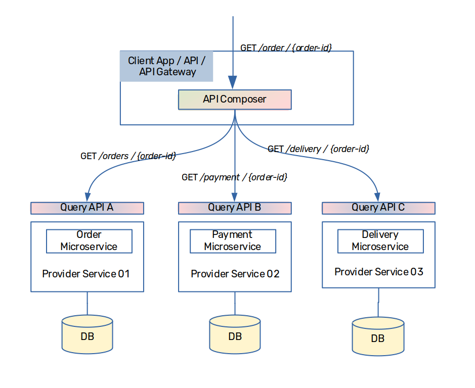
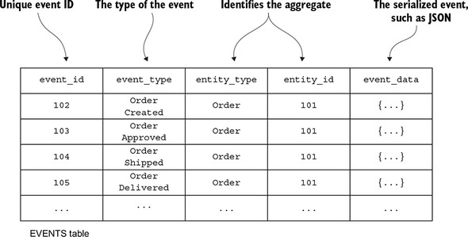
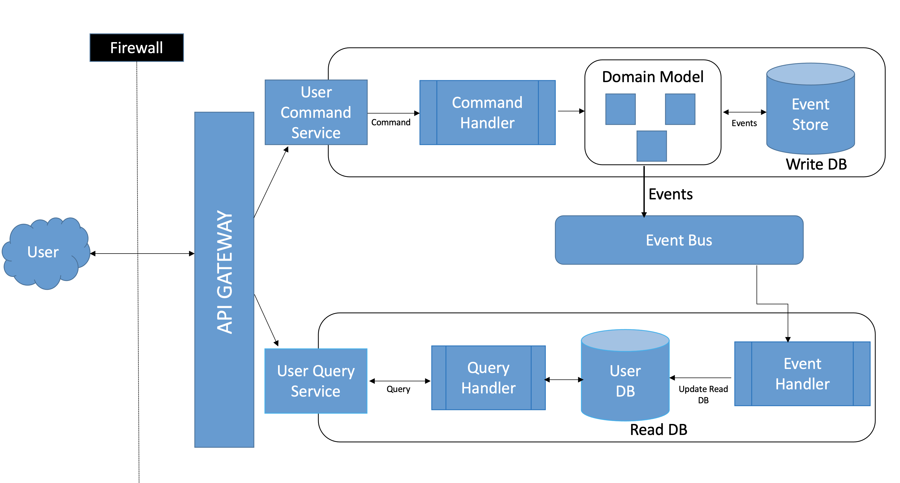

# CQRS + Event Sourcing Or API Composition + State Based

> 今回はマイクロサービスパターンで考慮される領域の一つである`CQRS`か`API Composition`についてとそれと共に使用される`Event Sourcing`か`State Based`かの比較を行う.
> そのためにここでは, 各利点, 欠点を調べる.

## API Composition

マイクロサービスは各サービスにデータが分散しており, 必要なデータがサービスを跨いでいる場合がある.この解決方法として, `API Composition`パターンが挙げられる.

このパターンでは, 上記の図が示すように一箇所が各サービスからデータを収集して, それを統合する役割を担うアーキテクチャである.実装場所としては以下の3パターンが考えられる.

1. Client App
   クライアントアプリケーションで実行する場合, サーバー側での考慮事項は少なく, ただ各サービスにてリクエストを待ち受けるだけでいい反面, クライアント側での実装が複雑になり, 特に複数エンドポイントへのアクセスが必要になることでの, クライアント-サーバー間のトラフィック増加が考えられる.
2. API Gateway
   API Gatewayを用意している場合は, API Gatewayの役割の一つとしてAPI Compositionを構成する場合も多く, クライアント側からは単一のエンドポイントでアクセス可能になる.ただし, API Gatewayの負荷が高まる可能性がある.
3. 専用Service
   このパターンでは, API Composition専用のサービスを建てるため, 負荷の面でも結合度の面でも`2`よりも有効である.ただし, サービス間通信が増える点からパフォーマンスへの影響も考えられる.

今回のアプリケーションではAPI Gatewayで行うこととする.

## Event SourcingとState Based

Event Sourcingでは上記のようなテーブルで保持しており, 現在の状態のみを保存する従来のState Basedパターンとは異なり, イベントを全て保管している. 
基本的に全てのPOST, PUT, DELETEもレコードの追加で行われることになる.

| 項目 | **State Based** | **Event Sourcing** |
| --- | --- | --- |
| **基本概念** | 現在の状態（データの最新バージョン）だけを保持する. | データのすべての変更（イベント）を記録し, イベントの履歴を基に現在の状態を再構築する. |
| **データ保存方法** | エンティティやオブジェクトの最新の状態だけをデータベースに保存. | すべての変更をイベントとして順番に記録し, 状態をその履歴から再現する. |
| **履歴の保存** | 最新の状態のみ保持.過去の状態や変更履歴は上書きされ, 失われる. | すべての変更履歴が保存され, どの時点の状態も再現可能. |
| **読み取りの容易さ** | 最新の状態をクエリするだけなので, シンプルで高速. | 状態を再現するためにはイベントのリプレイが必要になるため, 複雑になる場合がある. |
| **スケーラビリティ** | 単純な操作であるため, 読み取り・書き込みの負荷は低い. | イベントが増えると読み取り時のリプレイやイベントの集約処理が必要になることがあるが, パフォーマンスは工夫次第で拡張可能. |
| **データの一貫性** | 常に最新の状態のみを管理.データの一貫性が比較的簡単に保たれる. | イベントの順序や処理に依存するため, データの一貫性を保つ仕組みが必要. |
| **監査や追跡** | 変更履歴がないため, 監査や過去の状態の再現が困難. | すべてのイベントが保存されているので, 過去の状態や変更履歴を詳細に追跡・監査可能. |
| **エラーの回復** | 最新の状態しかないため, データが破損すると元に戻すのが難しい. | イベントをリプレイすることで, データを任意の時点に回復できる. |
| **主な適用分野** | シンプルなデータ管理が求められるアプリケーション（小規模なCRUDアプリなど）. | 変更履歴や監査が重要なシステム, 複雑なドメインを扱うアプリケーション（金融, Eコマースなど）. |
| **実装の難易度** | 比較的シンプルで, 一般的なCRUD操作に基づいている. | 複雑な実装が必要で, 特にイベントの整合性やリプレイの管理が難しい. |

## Event SourcingとState Basedパターンの利点と欠点

### **State Based の利点**
- シンプルな構造と実装.
- データの操作が簡単で, パフォーマンスも良好.
- 一貫性のあるデータを扱うのが容易.

### **State Based の欠点**
- 変更履歴が失われるため, 過去の状態やデータ変更の監査ができない.
- データの破損やエラー発生時に回復が難しい.

### **Event Sourcing の利点**
- すべての変更履歴を保存するため, 過去の状態の再現や監査が容易.
- エラーやデータ破損時にイベントをリプレイして状態を復元できる.
- 非同期処理や分散システムとの相性が良い.

### **Event Sourcing の欠点**
- イベントの管理が複雑で, リプレイやイベントの整合性に注意が必要.
- 実装が複雑になりがちで, 特にパフォーマンスの最適化が課題になる場合がある.

## Event Sourcingの課題

Event Sourcingパターンの課題の一つとして, 現在の状態を取得するリクエストに対しては, 全てのレコードよりその状態を再現して, その結果を返す必要があるため, レコード数を多くなればなるほど, パフォーマンスに悪影響を与える.

## CQRS

CQRSでは, GETをクエリ, POST, PUT, DELETEなどの操作をコマンドと呼び, それぞれのサービスを用意する.ここで用いられるのがEvent Sourcingパターンであり, コマンドに対応するドメインサービスはイベントの形で保管する.このサービスに変更があったことをトリガーにして, State Basedであるクエリ専用ドメインサービスが同期する. 
イベントを全て記憶することができ, 非同期処理との相性がいいEvent Sourcingの利点を加味しながら, 状態の取得のパフォーマンス低下や複雑性を回避することもできる.

通常, これらはメッセージブローカーのPub/Subによって実現されるため, クエリ専用サービスも必要に応じて, 必要なコマンドサービスをサブスクライブすることで利用可能なデータとなる. 

> 今回は**最終的整合性**で十分な場合に利用されるイベントソーシングパターンを利用しているが, **強い一貫性**を求める場合は, **分散ロック**や**Outboxパターン**を活用することもある.

## API CompositionとCQRSの利点と欠点

### API Composition

#### 利点
- **シンプルな実装**: API GatewayやBFFなどで複数のサービスからデータを集約するだけなので, 比較的簡単に実装可能.
- **柔軟性**: 複数のマイクロサービスからデータを動的に取得し, 異なるクライアントやユースケースに合わせたデータを提供できる.
- **データ整合性**: CQRSと比較すると, コマンド系処理が実行されたものがすぐに取得に反映されていることが保証されている.

#### 欠点
- **パフォーマンスの問題**: GETの際には各リクエストで複数のマイクロサービスを呼び出すため, ネットワーク遅延や過剰なサービス間通信が発生しやすい.
- **メモリ負荷**: API Compositionを行うサービスが, 様々なデータを収集して結合する必要があるため, 多くのメモリ使用が考えられる.
- **可用性**: 取得時における可用性について, 関連する全てのサービスが利用可能である状態でなければならない.

### CQRS (Command Query Responsibility Segregation)

#### 利点
- **スケーラビリティ**: 読み取りと書き込みを分離することで, 読み込みリクエストが多い場合でも読み取り用のデータベースをスケールアウトできる.
- **パフォーマンスの向上**: 読み取りに特化したデータベースを最適化することで, クエリパフォーマンスが向上し, 大量のリクエストに耐えることができる.
- **技術スタックの選択**: 書き込みと読み込みの処理が分かれているため, 異なる要件に対して適切なデータ構造やアプローチを使用できる.
- **イベントソーシングとの相性**: CQRSはイベントソーシングと組み合わせることで, 過去の状態や変更履歴を保持しながらも, 効率的なクエリを実現できる.

#### 欠点
- **複雑な実装**: 読み取りと書き込みを分ける設計が複雑であり, データの同期や一貫性を保つための追加の開発が必要.
- **データの整合性の遅延**: 書き込み後に読み取りのデータが反映されるまでの遅延が発生することがあり, 強い一貫性を求めるシステムには適していない場合がある.
- **インフラストラクチャの複雑化**: 読み取り用と書き込み用に別のデータストアを用意する必要があり, 管理と運用が複雑化する.
- **学習コスト**: CQRSを理解し, 適切に実装するためには, アーキテクチャやパターンについての深い理解が必要となる.

## 参照
- [Microservices Patterns: API Composition and CQRS Patterns](https://crishantha.medium.com/microservices-patterns-api-composition-pattern-27040cae5bd3)
- [Developing business logic with event sourcing](https://livebook.manning.com/book/microservices-patterns/chapter-6/)
- [CQRS Event Sourcing Example](https://github.com/ketan-gote/cqrs-eventsourcing-user-microservice)

